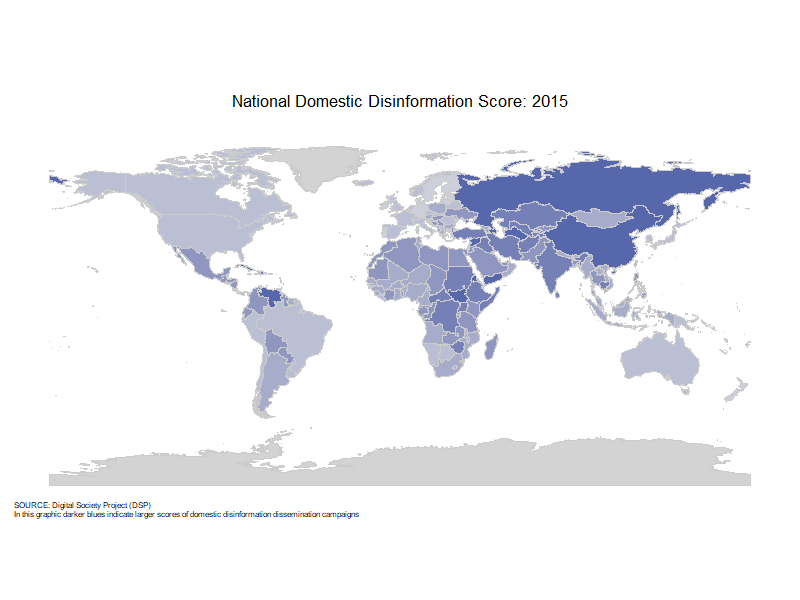

# Data

```{r, libraries_3}
library(tidyverse)
library(gganimate)
library(gifski)
library(sf)
library(rnaturalearth)
library(ggthemes)
library(paletteer)
```

```{r, publication_theme_3}
theme_Publication <- function(base_size=14, base_family="sans") {
      library(grid)
      library(ggthemes)
      (theme_foundation(base_size=base_size, base_family=base_family)
       + theme(plot.title = element_text(face = "bold",
                                         size = rel(1.2), hjust = 0.5, margin = margin(0,0,20,0)),
               text = element_text(),
               panel.background = element_rect(colour = NA),
               plot.background = element_rect(colour = NA),
               plot.caption = element_text(hjust = 0),
               plot.caption.position = "plot",
               panel.border = element_rect(colour = NA),
               axis.title = element_text(face = "bold",size = rel(1)),
               axis.title.y = element_text(angle=90,vjust =2),
               axis.title.x = element_text(vjust = -0.2),
               axis.text = element_text(), 
               axis.line.x = element_line(colour="black"),
               axis.line.y = element_line(colour="black"),
               axis.ticks = element_line(),
               panel.grid.major = element_line(colour="#f0f0f0"),
               panel.grid.minor = element_blank(),
               legend.key = element_rect(colour = NA),
               legend.position = "bottom",
               legend.direction = "horizontal",
               legend.box = "vetical",
               legend.key.size= unit(0.5, "cm"),
               #legend.margin = unit(0, "cm"),
               legend.title = element_text(face="italic"),
               plot.margin=unit(c(10,5,5,5),"mm"),
               strip.background=element_rect(colour="#f0f0f0",fill="#f0f0f0"),
               strip.text = element_text(face="bold")
       ))
      
}
```

This project utilizes two primary data sources. Media tone characteristics were sourced from the GDELT Project (Global Database of Events Language and Tone), which monitors broadcast, print, and web news. Organized at the article level, it lists the date and location of the media in addition to various tone, theme, and content measures. The database holds around 2.5T of information per year. GDELT has an open license and is free for the general public to use. While information spans decades, changes in collection methodology leaves data prior to 2015 unreliable for our project. 

Ratings of disinformation detection for each nation of interest were derived from measures provided by the Digital Society Project (DSP). The DSP conducts research regarding the cross section of internet and politics. Since 2000, the project has gathered annual national data across 179 countries. They do this by having a survey that asks country experts to assess how frequently different political actors use varied types of media to spread misleading or false information, and distinguishes both the actor responsible and the audience being targeted. In their primary dataset, they measure 33 expert-rated indicators of freedoms in internet and politics. We isolated indicators of targeted misinformation campaigns and recorded data from 2015 to 2025 in order to match the scope of GDELT.   

**Transformation Methods**

To begin media measure ingestion through the GDELT project, we first had to design a system of aggregation at the country-year level, as the database's raw data is stored at the article level, describing trillions of observations of article features. The database is accessible only through the Google service BigQuery, which limits interapplication operability but allows for SQL query interaction and data exportation. Due to these limitations we created a multilayered table view which we transferred as a flat file. 

```{r, bar_theme_setup}
full_gdelt <- read_csv("sources/GDELT_Aggregates.csv")
themes_yearly <- full_gdelt |> 
  select("n_election_democracy", "n_governance_trust", "n_identity_division",
         "n_migration_displacement", "n_public_health_crisis", "n_economic_instability",
         "n_information_environment", "n_military_conflict", "n_cybersecurity_infrastructure",
         "n_social_unrest", "n_climate_environment", "year")

themes_yearly <- themes_yearly |> 
  group_by(year) |> 
  summarise(across(starts_with("n_"), \(x) sum(x, na.rm = TRUE)), .groups = "drop")
themes_yearly <- themes_yearly |> 
  pivot_longer(
    cols = starts_with("n_"), names_to = "theme", values_to = "total"
  ) |> 
  mutate(theme = str_remove(theme, "^n_") |> str_replace_all("_", " ") |> str_to_title())

theme_order_2015 <- themes_yearly |> 
  filter(year == 2025) |> 
  arrange(total) |> 
  pull(theme)
themes_yearly <- themes_yearly |> 
  mutate(theme = factor(theme, levels = theme_order_2015))
```

::::: columns
::: {.column width="40%"}
| Text Analysis Measures Collected Across Themes |
|------------------------------------------------|
| Article Count (raw & relative)                 |
| Language Tone (negative vs positive)           |
| Language Polarity (emotionality)               |
| Language Activity (vs passivity)               |
| Social Media Embeddings (count)                |
| World Length (avg & bucket counts)             |
:::

::: {.column width="60%"}
```{r, bar_theme_graph}
my_colors <- rev(paletteer_d("ggthemes::Miller_Stone"))

ggplot(themes_yearly, aes(x = factor(year), y = total, fill = theme)) +
  geom_col(position = "fill") +
  scale_y_continuous(labels = scales::percent) +
  scale_fill_manual(values = as.character(my_colors)) +
  labs(
    x = "Year", y = "Proportion of Thematic Volume",
    fill = "Theme",
    title = "Yearly Proportional Makeup \nof Disinformation Themes"
  ) +
  theme_Publication() +
  theme(axis.text.x = element_text(angle = 45, hjust = 1),
        legend.position = "right",
        legend.direction = "vertical")
```
:::
:::::

\
Our final aggregated dataset included 19 summary statistics at the country-year level overall and across 11 theme groups. Summary statistics encompassed article counts both raw and relative to that observation, positive/negative tone, language polarity, language activity/passivity, group vs self language, the presence of social media embeddings, average words lengths, and shares of world length buckets (short, medium, long, very long). Theme groups included one neutral theme and 10 themes derived from previous literature regarding the relationship between mass media and disinformation campaigns. These themes were: Social Unrest, Social Identity Division, Military Conflict, Governance Trust, Information Environment, Economic Instability, Democratic Elections, Public Health, Climate Environment, Migration, and Cyber Security \[2\]. Articles were flagged as a particular theme according to content tags provided by GDELT. Of the thousands of possible content tags we chose 10-20 to represent each theme group in order to ensure specificity of grouping. These theme groups were non-exclusive with each article falling under 2 themes on average, a level we found appropriately representative of the varied nature of article content. GDELT querying resulted in a raw aggregate table containing 3,148 observations of 249 columns, which we then transformed into a final feature vector of 2,591 observations of 174 variables. 

To begin feature transformations we removed unuseful information which we recorded as a precaution, namely variation scores for each recorded average. Each theme’s metrics were then shrunk in comparison to the same measure of the baseline theme in that country-year. Shrinking allowed us to maintain the inherent social context of a nation or language and reduce the signal of themes with little record. Finally, measures were logged (or Center Log Ratioed) to account for the major skew in the data. 

Of the 33 variables selected from the DSP, we chose 4 which were averaged to create a domestic-sourced and a foreign-sourced dissemination score variable respectively. The foreign score combines two DSP indicators: the frequency that foreign governments and their agents use social media to spread misleading information about a country's domestic politics, and the frequency that they do through paid advertisements. The domestic score similarly combines two indicators: how often a country's own government disseminates false information to influence its population, and how often major political parties and candidates do the same. Together, these capture disinformation spread through official state networks as well as partisan political organizations, both of which originate within the country and not from a foreign actor.

```{r, map_gif}
# gif was generated outside and imported due to rendering limitations of the package
```


